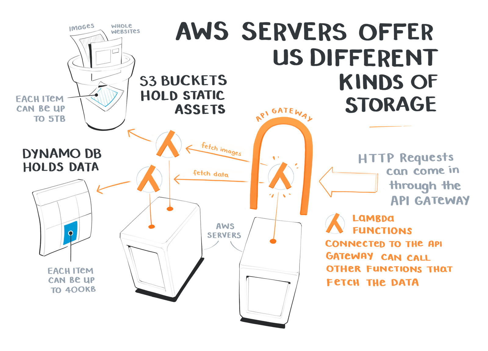

# Create a DynamoDB table with AWS CDK

**[📹 Video](https://egghead.io/lessons/aws-create-a-dynamodb-table-with-aws-cdk)**

Let's hook our app to a database. We'll be using [DynamoDB](https://aws.amazon.com/dynamodb/), which is a **NoSQL** database.



🤔 Sidenote: What is NoSQL?

NoSQL allows you to add any kind of data in your database because it is flexible. So we don't have to design a precise schema in advance, we can just start adding our data.

Run:

* `npm install --save @aws-cdk/aws-dynamodb`

Import dynamodb to our backend then create a new dynamo db table.

```ts
  // save it as a const since we'll use it in a little bit
      const todosTable = new dynamodb.Table(this, "TodoTable", {
        //a unique key
            partitionKey: { name: "id", type: dynamodb.AttributeType.STRING }
        });
```

👍 Once deployed, you can find the dynamodb resources in the `aws` console (Services - CloudFormattion - TodoAppStack).

Let's add an item to the table: click on the **Items** tab, then **Create item**.

Add an `id` then `append` to `String` items:

```ts
id: String: 123
todo String: Add DynamoDB
isComplete: true
```


